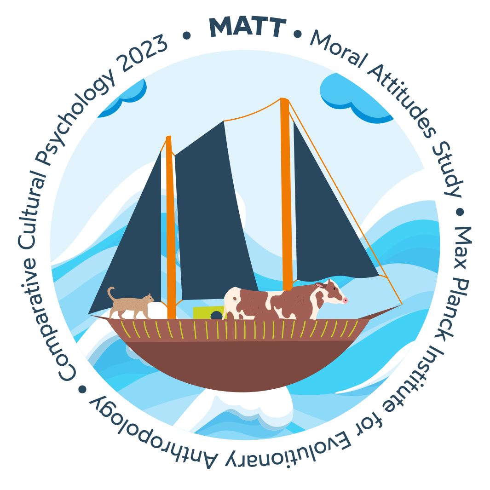
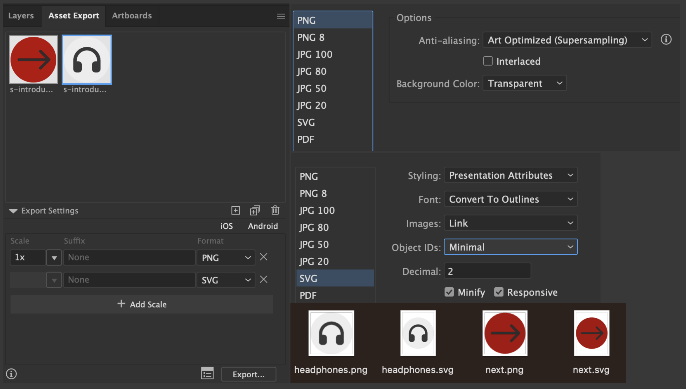
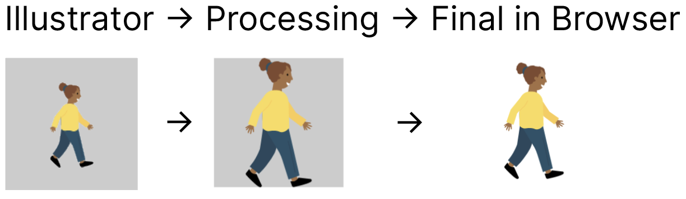
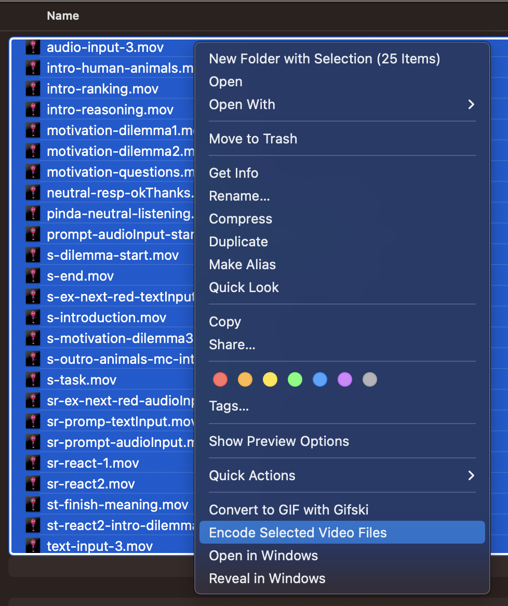
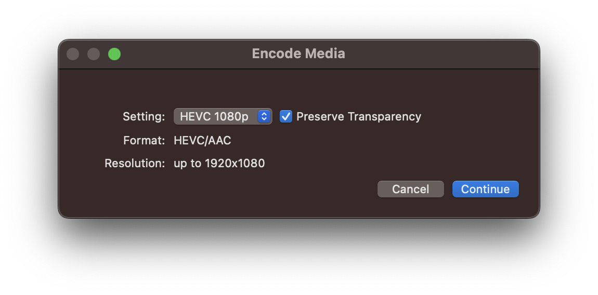
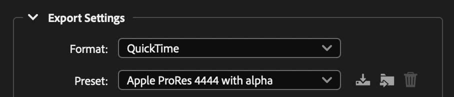

# MATT

> **Moral Attitudes Study**  
> A browser-based game that investigates  
> **TODO**
>
> **🚀 Demos:**
>
> - **https://ccp-eva.github.io/matt/**
>   - <small>Automatically generated from main branch (no data will be send to any server, see here [how-to](#deploy-to-github-staging-site))</small>
> - **https://ccp-odc.eva.mpg.de/matt/**
>   - <small>Deployment site (data can be send to server, see here [how-to](#deploy-to-mpi-server))</small>

---

- [Study Overview](#study-overview)
- [Development \& Customization](#development--customization)
  - [Gettting started](#gettting-started)
  - [URL Parameters](#url-parameters)
  - [How To Add A New Culture](#how-to-add-a-new-culture)
  - [How To Add New Slide](#how-to-add-new-slide)
    - [❡ Adding Text](#-adding-text)
    - [♲ Recycle/Reuse Objects](#-recyclereuse-objects)
  - [Adobe Character Animator Workflow](#adobe-character-animator-workflow)
  - [Global Objects](#global-objects)
    - [`data`](#data)
    - [`config`](#config)
    - [`downloadData()`](#downloaddata)
    - [`uploadData()`](#uploaddata)
  - [Deploy to GitHub Staging Site](#deploy-to-github-staging-site)
  - [Offline Usage](#offline-usage)
  - [Deploy to MPI Server](#deploy-to-mpi-server)
    - [Manual Steps](#manual-steps)
- [Contributions](#contributions)
  - [Voice-over Speakers](#voice-over-speakers)
  - [Localization Translators](#localization-translators)

---

## Study Overview

 <p align="right"><sup><sub>inspired by [unDraw](https://undraw.co/illustrations)</sub></sup></p>

- Link to prereg
- ...

## Development & Customization

### Gettting started

1. `git clone git@github.com:ccp-eva/matt.git`
2. `cd matt`
3. `npm i`
4. `npm start`

The experiment consists of two components: (1) a **landing page** and (2) the **experiment**. The landing page is vanilla HTML, CSS, JavaScript and is not part of the webpack setup. This landing page is located in the `public` directory:

**Landing page** files:

- `public/index.html`
- `public/index.css`
- `public/index.js`

**The experiment** is located under `src` the root entry point is `app.ts`.

If you build and deploy the web app. The landing page is: `yoururl.com/index.html`. By convention `index.html` can be omitted. That means going to `yoururl.com` will navigate you to the landing page. The experiment will be exposed via `yoururl.com/app.html`.

**NOTES**

- The primary purpose of the landing page is to provide a UI to ask the user for required properies that the expiment needs in order to run. If you provide no or incomplete URL parameters, defaults will be used (see table below).
- All properties can also be controlled via URL parameters.
- If you provide URL parameters for the landing page, the corresponding fields will be hidden
- All URL parameters are identical for the landing and experiment page
  - That means, you can skip the landing page entirely if you provide the required URL parameters for the experiment

### URL Parameters

You can modify the experiment by attaching various URL parameters, for example:  
https://ccp-eva.github.io/matt/app?id=johndoe&culture=de-urban&birthday=1987-02-22&gender=male&input=text&datatransfer=server

| Parameter key  | Explanation & Default value (if no param provided)                                                                                                                                                                                                                                                                                                                                                                                                                                                     | Restrictions                                                                                                            |
| -------------- | ------------------------------------------------------------------------------------------------------------------------------------------------------------------------------------------------------------------------------------------------------------------------------------------------------------------------------------------------------------------------------------------------------------------------------------------------------------------------------------------------------ | ----------------------------------------------------------------------------------------------------------------------- |
| `id`           | Participant name or id<br><br>**Default value** `demo`                                                                                                                                                                                                                                                                                                                                                                                                                                                 | Special Characters are disallowed. Input length is limited to ≤ 30 chars                                                |
| `culture`      | Changes, text, audio, and visuals<br><br>**Default value** `de-urban`                                                                                                                                                                                                                                                                                                                                                                                                                                  | Any value defined with procedure key in [config.yaml](https://github.com/ccp-eva/matt/blob/develop/src/config.yaml#L45) |
| `birthday`     | A year in the format YYYY-MM-DD. Depending on the given age (threshold is configurabel [here](https://github.com/ccp-eva/matt/blob/develop/src/config.yaml#L37)), a different experiment version will be loaded (child or adult).<br>**Tip**: If you don't want the user to enter a birthday but want them to direct to the child or adult version, just provide a date which is easy to detect in data analysis, e.g.,<br>- **child:** `2100-01-01` (**default value**)<br>- **adult:** `1900-01-01`. | A string in the format `YYYY-MM-DD`. `Y, M, D` need to be numbers                                                       |
| `gender`       | Participant’s gender.<br><br>**Default value** `none`                                                                                                                                                                                                                                                                                                                                                                                                                                                  | Either `female`, `male`, `diverse`, or `none`                                                                           |
| `input`        | Respond either by text or audio input, or leave it up the the user to decide. `userchoice-audio` (**default value**) will land on audio first. <br>`userchoice-text` will land on text first.                                                                                                                                                                                                                                                                                                          | Either `text`, `audio` or `userchoice-audio`, `userchoice-text`                                                         |
| `datatransfer` | The way where response data is sent to. `server` will use the php endpoint. `both` (**default value**) calls `downloadData()` and you will also get a local copy of your data.                                                                                                                                                                                                                                                                                                                         | Can either be: `both` (default) or `server`                                                                             |

Culture parameters are composed of a country code (i.e, [ISO 3166-1 alpha-2](https://en.wikipedia.org/wiki/ISO_3166-1_alpha-2), lowercased (e.g., de)) and an arbitrary suffix (i.e., rural or urban). For example: `de-urban`.

### How To Add A New Culture

1. If necessary add new layers to Illustrator if need to change or adjust visuals (see link to how to)
2. Create a new folder unter cultures using ISO 3166-1 alpha-2 country codes (e.g., pe-rural)
3. Copy and Paste another the audio and video folder from another culture into your new culture.
4. Modify you audio and video files accordingly, keep files names to avoid coding adjustments
5. Add translation keys into `translations.ts`
6. Add the slider order in `config.yaml`
7. Make sure to set the culture parameter, as it defaults to de-urban and not your new culture, unless you change it in config.yaml

### How To Add New Slide

1. Open Illustrator
2. Create a new layer or copy another as a template
3. If you have images follow the steps in: [#### ♲ Recycle/Reuse Objects]
4. If have text follow the steps in: [...]
5. Arrage the texts and objects to your needs
6. When done, Make sure that all Layers are visible in Illustrator
7. Save your Ai
8. Save a SVG Copy using Cmd+Option+S or File ⮕ Save a Copy
9. Filename must be `experiment.svg` and you can replace the existing one
10. Exporting Options should look like this:

|  |
| :---------------------------------: |
|    _Illustrator Export Settings_    |

11. Run `npm run voxify`
12. Add the Illustrator layer name to config.yaml
13. Create a new TypeScript file with the camelCased name of your Illustrator file within the procedure folder (e.g., my-slide become mySlide.ts). You can use the `sTemplate.ts` file as a template or even better: use a similar slide as template.
14. For debuggin open DevTools: Cmd+Option+I
15. Open `custom.d.ts` if you need to store new response data
16. Response data is globally stored in `data` object within DevTools
17. Run `npm start`

#### ❡ Adding Text

1. Create a new rectangle in Illustrator. Its size defines the bounding box of the text, yet not determines the text size. Text size can be controlled in CSS within `styles.css`. Give this rectangle a name prefixed with text- (e.g., `text-objectChoiceRandom`). Use camelCase, avoid numbers.
2. Add a new key to all translation files within `src/cultures/xx-xx/translation.ts`. Use the identical id as defined prior in Illustrator, yet, without the prefix (e.g., `objectChoiceRandom`).  
   The **value** should be a valid HTML text node (usually, you will use `<p>`, or `<h1>`, `<h2>`, etc.). For example:

```javascript
export const translation = {
	objectChoiceRandom: '<p>Select a single arbitrary object!</p>',
	objectChoiceMultiple: '<p>Select multiple objects!</p>',
};
```

3. The text will automatically appear at the defined location of your rectangle.

#### ♲ Recycle/Reuse Objects

If you use an SVG object more than once, and your object is a more complex shape (involving `path`), you may opt-in to use object recycling following this steps:

1. Identify the object(s) you want to reuse in your composition, and follow the next steps:
2. **(Optional)** Configure Asset Export Settings:

|     |
| :------------------------------------: |
| _Asset Export Settings in Illustrator_ |

3. Export your target object as SVG (this will be your **link**ed reference) and PNG (this will be your **p**lace**h**older for target location and size. Put those two files into `/assets/` directory.
4. Uniquely rename both files (e.g., `child.svg` and `child.png`, respectively)
5. Within Illustrator, create squares (make sure they are squares with the same width/height) having your desired target size and location within your composition (you can add a fill to make them visible, avoid strokes). Use the shapes you exported as a tempalte for location and width/height.
6. Provide a unique id for the **p**lace**h**older square. **Prefix the id with `ph-`**. For example `ph-child`.
7. Since you created your placeholder squares, you can delete the prior exported SVG object from your SVG composition.
8. Drag and drop the PNG(!) file into Illustrator (this will automatically be a linked file).  
   _Note_: You don’t need to place the PNG file in your square or resize it to match its bounding box. It can be at any location in your composition. **Only the placeholder rectangle defines your target location and size**:

|          |
| :--------------------------------------------------------------: |
| _No need to adjust the png file to match the bounding box size!_ |

9. Provide a unique id for the linked PNG file. **Prefix the id with `link-`**. For example: `link-child`.  
   _Note_: The ids for the placeholder square and linked PNG should be identical apart from their prefix (`ph-child` & `link-child`).
10. If you re-use an object multiple times, incorporate other naming strategies to guarantee naming uniqueness (e.g., `link-slide2-child` and `ph-slide2-child` respectively). Or, if you use the same object multiple times on the same slide/layer, start numerating it (e.g., `link-slide2-child1`, `link-slide2-child2`, and `ph-slide2-child1`, `ph-slide2-child2`, respectively)
11. Profit

For further (implementation) details, see this issue: [#53](https://github.com/ccp-eva/matt/issues/53).

### Adobe Character Animator Workflow

---

---

<details>
  <summary>The story of cross-browser support for videos with alpha channel</summary>
  <br>
  <b>TL;DR:</b> Safari sucks.

**Problem**: We need transparent videos running in cross-browser.

**Formats with alpha channel:**

- Apple ProRes 4444 with alpha (Safari only)
- H265/HEVC with alpha (Safari only)
- WebM with alpha (FireFox, all Chromium-based browsers)

As of mid 2023 Adobe Character Animator can only export _Apple ProRes 4444 with alpha_ (see screenshot below). This format works in Safari (WebKit) but not for FireFox (Gecko) and the rest of Chromium-based browsers (Blink). This format is also supported by ffmpeg, see here for a great article: https://ottverse.com/ffmpeg-convert-to-apple-prores-422-4444-hq/.

However, ProRes isn’t great for video compression. Yet, for the web, we need to deliver small and still good looking videos:

> ProRes is basically used as an intermediate compression format and is not to be used to compress videos with an intention of getting high compression efficiency. The goal of ProRes is to retain the video quality while attaining an agreeable amount of compression.

**Solution for FireFox and Chromium-based browsers**

**WebM** is great and ffmpeg support is superb for a transparent video input (e.g., ProRes):

```bash
ffmpeg -i in.mov -c:v libvpx-vp9 -b:v 500k -c:a libvorbis out.webm
```

**Solution for Safari**

**H265/HEVC**

Safari does support WebM but not WebM with not WebM w/ alpha channel. And since ProRes files are way to large, we need to use H265/HEVC with alpha. This format is supported by Safari, but not by ffmpeg, as of mid 2023: https://trac.ffmpeg.org/ticket/7965.

There is a workaround, which only works on macOS devices using _VideoToolbox_ for ffmpeg: https://www.soft8soft.com/wiki/index.php/Video_textures_and_alpha_transparency

```bash
ffmpeg -c:v libvpx-vp9 -i movie-webm.webm -c:v hevc_videotoolbox -alpha_quality 0.75 -vtag hvc1 movie-hevc.mov
```

However, you need to have a special compiled version of ffmpeg. Not willing to go this path and expext others to follow.

**Solution: avconvert** to get H265/HEVC with alpha channel

You can eitehr use the UI or the CLI version of avconvert. The UI version is integrated into Mac’s Finder App:

|                      |                 |
| :------------------------------------------------------------------------: | :----------------------------------------------------------: |
| _Select vidoe file(s), right click and select Encode Selected Video Files_ | _Select HEVC 1080p, and check the Preserve Transparency box_ |

You can acomplish the same in the terminal:

Single File:

```bash
avconvert --source input.mov --preset PresetHEVC1920x1080WithAlpha --verbose --replace --output output.mov
```

Multiple Files (make sure to have a `out` directory)

```bash
do avconvert --source "$i" --preset PresetHEVC1920x1080WithAlpha --verbose --replace --output "out/${i%.*}.mov"; done
```

You are done!

- H265/HEVC/mov for Safari
- WebM for FireFox and Chromium-based browsers

</details>

---

---

1. Edit your videos in Adobe Character Animator and export them using via: `File → Export → Video with Alpha via Adobe Media Encoder`

2. This will open Media Encoder. Click the play button to start the rendering process.

_Note, the export format must be **Apple ProRes 4444 with alpha**. As of Summer 2023._

|                      |
| :-----------------------------------------------------------: |
| _Adobe Media Encoder Export Settings from Character Animator_ |

3. Once you have your \*.mov video files. Copy all of the video files to the folder: `character-animator`.
4. Run `npm run alphaPinda` in your terminal
5. This will create a subdirectory `out` and you will find two files for every input file (mov for Safari, webm for all other browsers). Once the conversion is done, copy all the video files into your video folder of you culture.

### Global Objects

In the production build, 4 objects get exposed globally:

- `data`
- `config`
- `downloadData()`
- `uploadData()`

#### `data`

This object holds all response data and other client information. This objects gets downloaded (and uploaded) in the last slide. You can inspect the current data object by entering `data` in your browser’s console.

#### `config`

This object prints the current experiment configuration file (i.e., [config.yaml](/src/config.yaml)) in JSON format.

#### `downloadData()`

Transforms the `data` object into a JSON format, and downloads the file locally. The functions gets called on the last slide (depending on your `datatransfer` parameter). You can call the function at any time to download the current `data` object as JSON by entering `downloadData()` in your browser’s console.

#### `uploadData()`

Transforms the `data` object into a JSON format, and uploads the file the a given endpoint. The functions gets called on the last slide. You can call the function at any time to upload the current `data` object as JSON by entering `uploadData()` in your browser’s console.

### Deploy to GitHub Staging Site

1. Push everything to develop
2. Switch to `main` branch: `git switch main`
3. Merge latest changes from `develop` into `main`: `git merge develop`
4. `git status` should show that you are ahead of `origin/main`
5. push to main: `git push`
6. This will trigger a [GitHub Action](https://github.com/ccp-eva/matt/actions)
7. After 2 to 3 minutes the website is live here: https://ccp-eva.github.io/matt/

### Offline Usage

1. Install nodejs
2. Install live-server globally `npm i -g live-server`
3. Download this repo at gh-pages branch: https://github.com/ccp-eva/matt/archive/refs/heads/gh-pages.zip
4. unzip matt-gh-pages
5. cd into that gh-pages folder and run `liver-server`
6. Your default browser will open

### Deploy to MPI Server

#### Manual Steps

1. Make your changes
2. Test with npm start if you changes work
   1. Following steps are **optionally**:
   2. Commit your changes into `develop` branch
   3. Merge your changes into main (this will rollout to GitHub Staging Site, [see here](#deploy-to-github-staging-site))
      1. (`git switch main` → `git merge develop --commit -m""` → `git push`)
      2. Switch back to develop (`git switch develop`)
3. Make sure you are connected to the MPI network (VPN)
4. Deploy to MPI server: `npm run deploy`
   1. Make sure if have your a pre-configured ssh config, since the deploy script using ssh aliases
5. You see the transfer progress in your terminal, if that is complete the website is live here: http://ccp-odc.eva.mpg.de/matt/

## Contributions

### Voice-over Speakers

- `de-urban`: _Wilma Weigelt_ (wiweit@googlemail.com)

### Localization Translators

- `xy-xyz`: _Firstname Lastname_ (mail@example.com)
